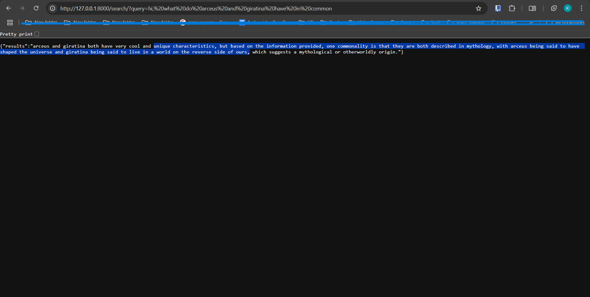
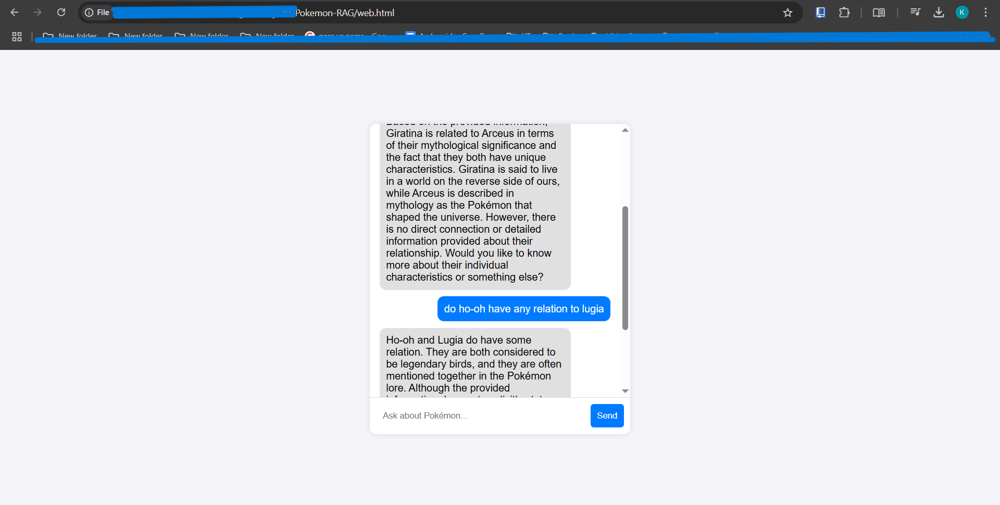

# Pokémon RAG System

This project is a **Retrieval-Augmented Generation (RAG) system** that allows users to retrieve Pokémon information using **natural language queries**. It combines **FastAPI**, **Pinecone**, and **an LLM (Llama-3)** to intelligently fetch Pokémon data.

---

## **📌 Features**
- Fetches Pokémon data from **PokeAPI** and stores it in a CSV file.
- Embeds Pokémon data into **Pinecone** for vector search.
- Uses an **LLM (Llama-3-70B)** to enhance responses.
- Provides a **FastAPI server** for queries.
- Includes a **chat-style frontend** for easy interaction.

---

## **⚡ Installation & Setup**

### **1️⃣ Clone the Repository**
```bash
git clone https://github.com/KushPatel-18/Pokemon-RAG.git
cd pokemon-rag
```

### **2️⃣ Create a Virtual Environment**
Ensure you're working in a virtual environment to keep dependencies isolated.
```bash
python -m venv venv
source venv/bin/activate  # macOS/Linux
venv\Scripts\activate    # Windows
```

### **3️⃣ Install Dependencies**
```bash
pip install -r requirements.txt
```
If you don't have a `requirements.txt` file, install the dependencies manually:
```bash
pip install fastapi uvicorn pinecone-client pandas python-dotenv transformers torch together tqdm requests
```

---

## **🔑 Setting Up API Keys (.env File Required!)**

You **must** create a `.env` file in the root directory with the following keys:

```ini
PINECONE_API_KEY=your_pinecone_api_key_here
TOGETHER_API_KEY=your_together_ai_api_key_here
```

### **📌 How to Get API Keys?**
- **Pinecone API Key** → [Sign up at Pinecone](https://www.pinecone.io/) and create an index.
- **Together AI API Key** → [Sign up at Together AI](https://www.together.ai/) and get a free key.

---

## **📥 4️⃣ Download Pokémon Data**
Before running the application, you need to **fetch Pokémon data** and store it in a CSV file.

```bash
python data_downloader.py
```
This will create a `pokemon_data.csv` file containing all the Pokémon details.

---

## **📤 5️⃣ Upload Pokémon Data to Pinecone**
Once the data is downloaded, you need to **upload it to Pinecone** for vector search.

```bash
python data_utils.py
```
✅ This will process the CSV and store embeddings in Pinecone.

---

## **🚀 6️⃣ Start the FastAPI Server**
To enable searching via API, run the FastAPI server:

```bash
uvicorn app:app --reload
```
The server will start at **http://127.0.0.1:8000**

### **🛠 Test API Locally**
Open a browser or use `curl` to test the API:

```bash
http://127.0.0.1:8000/search/?query=What is the height of Charizard?
```

Expected JSON response:
```json
{
    "results": "The height is 17."
}
```

#### Example backend server screenshot 


---

## **💻 7️⃣ Run the Web Interface**
To test the chatbot frontend:

1. Open `web.html` in a browser.
2. Ensure the **backend URL in the JavaScript** points to your FastAPI server:

```html
fetch(`http://127.0.0.1:8000/search/?query=${encodeURIComponent(userText)}`)
```

3. **Ask a question!** The chatbot will return Pokémon-related responses.

#### Example frontend screenshot 


---


## **🎯 Summary of Commands**
| **Step** | **Command** |
|---------|------------|
| **Install dependencies** | `pip install -r requirements.txt` |
| **Fetch Pokémon data** | `python data_downloader.py` |
| **Upload data to Pinecone** | `python data_utils.py` |
| **Start FastAPI server** | `uvicorn app:app --reload` |
| **Test API** | `http://127.0.0.1:8000/search/?query=Pikachu` |
| **Run frontend** | Open `web.html` in a browser |

---

## **🌎 Deployment Options**
### **1️⃣ Render (Free & Easiest)**
1. **Push your code to GitHub**:
   ```bash
   git add .
   git commit -m "Initial commit"
   git push origin main
   ```
2. Go to [Render.com](https://render.com/) → Click **New Web Service**.
3. Select your repo and set:
   - Build Command: `pip install -r requirements.txt`
   - Start Command: `uvicorn app:app --host 0.0.0.0 --port 8000`

4. Add environment variables (`PINECONE_API_KEY`, `TOGETHER_API_KEY`).
5. Click **Deploy**!

Your API will be available at:
```
https://{your-app-name}.onrender.com/search/?query=Charizard
```

### **2️⃣ Fly.io (More Control)**
```bash
fly launch
fly deploy
```

### **3️⃣ Google Cloud Run (Auto-Scaling)**
```bash
gcloud run deploy pokemon-rag --source .
```

---

## **📌 Troubleshooting**

**❌ Error: `ModuleNotFoundError: No module named 'fastapi'`**  
✅ Run: `pip install fastapi uvicorn`

**❌ `TypeError: Pinecone.create_index() missing 'spec'`**  
✅ Update `data_utils.py`:
```python
from pinecone import ServerlessSpec
pinecone.create_index(name, spec=ServerlessSpec(cloud="aws", region="us-east-1"))
```

**❌ Frontend Not Connecting?**  
✅ Make sure `web.html` is pointing to the correct backend URL.
